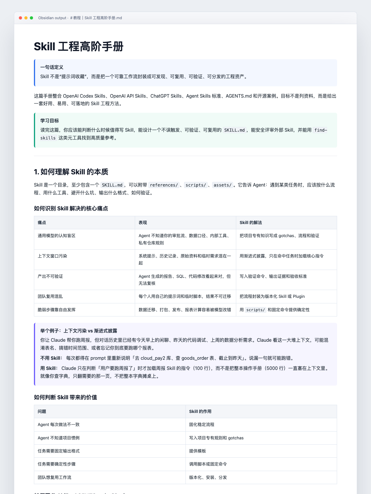

# Learn New Domain

Learn any domain from verified top sources. Extract the essence. Build MECE frameworks. Package reusable methods.



Actual output screenshot from the Obsidian tutorial **《Skill 工程高阶手册》** produced while developing this workflow. This is the real artifact shape: source-driven tutorial, methodology extraction, MECE tables, examples, and reusable operating rules.

## 中文简介

`learn-new-domain` 是一个帮助你系统学习新领域的 Agent Skill。

它不是让 AI “随便总结一下”，而是把学习过程工程化：

**先找精华信息源，再分别解构、二次萃取、MECE 建模、多轮追问，最后封装成可复用教程、方法论或 Skill。**

```text
确认学习领域
-> 确认输出形式
-> 联网寻找高质量信息源
-> 让用户确认信息源
-> 分别解读 Top 样本
-> 二次萃取核心原则
-> 建立 MECE 框架
-> 反复追问、补洞、压测
-> 打磨成教程 / 方法论 / 清单 / Playbook
-> 必要时封装成 Agent Skill
```

最重要的红线：**信息源不能造假。**

不能编链接、作者、日期、引用、GitHub stars、安装量、benchmark 数据，也不能把模型记忆伪装成信息源。打不开或没验证的资料，只能标记为 `unverified lead`。

### 它适合做什么

- 快速进入一个陌生领域
- 从官方文档、论文、源码、经典资料中提炼框架
- 把碎片资料整理成高阶教程
- 把复杂领域建模成 MECE 结构
- 产出方法论、学习路径、实操清单
- 把学习结果继续封装成 Agent Skill

### 中文使用示例

```text
Use $learn-new-domain 帮我系统学习 Agent Skills。
请先联网找最权威的信息源，让我确认后，再萃取核心原则，
最后输出一篇高阶教程和方法论框架。
```

---

`learn-new-domain` is an agent skill for turning an unfamiliar field into a practical tutorial, methodology, checklist, playbook, or agent skill.

It is not a generic summarizer. It is a source-first research and modeling workflow.

## Core Selling Points / 核心卖点

| Capability | What it means | 中文说明 |
|---|---|---|
| Verified top sources first | Start from official docs, specs, papers, source code, and canonical examples before synthesis | 先找最权威、最有信息密度的资料，而不是让模型凭记忆编教程 |
| Separate deconstruction | Read top samples one by one before merging conclusions | 先逐篇拆解，避免一上来混在一起总结导致精华丢失 |
| Second-order extraction | Extract principles, constraints, patterns, and failure modes behind the examples | 不只复述内容，而是萃取“为什么这样设计、什么情况下会失败” |
| MECE modeling | Build layered structures with clear boundaries and non-overlapping categories | 把领域拆成不重不漏的框架，方便学习、复用和检查 |
| Follow-up loop | Ask the user to challenge, deepen, and refine the artifact | 鼓励用户继续追问，把第一版打磨成真正可用的方法论 |
| Reusable packaging | Turn the result into a tutorial, checklist, playbook, or `SKILL.md` | 最终沉淀为可复用资产，而不是一次性聊天记录 |

```text
Confirm domain
-> confirm output format
-> search web for top sources
-> confirm sources with the user
-> deconstruct top samples separately
-> extract second-order principles
-> build a MECE model
-> ask follow-up questions
-> polish the tutorial or methodology
-> optionally package as an agent skill
```

## Why This Exists

Most AI learning workflows fail in predictable ways:

| Problem | What happens | This skill does instead |
|---|---|---|
| Fake or weak sources | The model invents links or treats random blogs as truth | Requires verified source maps and marks unverified leads |
| Shallow summarization | Produces a readable but weak overview | Extracts principles, gotchas, and reusable patterns |
| Non-MECE structure | Categories overlap or miss key parts | Builds layered, MECE models with boundaries |
| No iteration | Stops after one draft | Prompts the user to ask follow-up questions and refine |
| No reuse | Output becomes a one-off note | Packages results into tutorials, playbooks, checklists, or skills |

## Red Line: No Fake Sources

This skill is web-first and source-first.

It must not fabricate:

- URLs
- authors
- publication dates
- quotes
- GitHub stars
- install counts
- benchmark numbers
- claims of official status

If a source cannot be verified, it must be labeled as an unverified lead and excluded from evidence-based synthesis.

## Maintainer Red Lines / 维护红线

- Never add a `LICENSE` file or claim MIT, Apache, CC, proprietary, or any other license unless the owner explicitly chooses that exact license.
- Never treat a marketing poster as a screenshot. Any image labeled screenshot or demo must be generated from a real output artifact, product screen, CLI run, or reproducible example.
- Never present unverified links, stars, install counts, dates, authors, quotes, or official status as facts.
- 不得默认添加开源许可证。许可证是授权动作，必须由仓库所有者明确选择。
- 不得把产品宣传图冒充产出截图。截图必须来自真实输出、真实页面、真实命令行结果或可复现样例。
- 不得把未经验证的信息源包装成事实。

## What It Produces

The user can choose:

1. High-end tutorial
2. Methodology framework
3. Learning path
4. Practical checklist
5. Comparison/evaluation
6. Skill brief
7. `SKILL.md` draft

Default output: high-end tutorial plus methodology framework.

## Source Quality Ladder

| Tier | Source type | Use |
|---|---|---|
| S | Official docs, standards, papers, source code, filings, legal text | Define facts, constraints, and terminology |
| A | Classic books, top courses, expert long-form writing, benchmark case studies | Build judgment and frameworks |
| B | High-quality GitHub projects, real cases, benchmarks, industry reports | Learn practice and edge cases |
| C | Blogs, forum posts, newsletters, marketplace pages | Discover leads only |
| D | Model memory | Background only; never final evidence |

## Example Prompt

```text
Use $learn-new-domain to help me learn AI agent skills.
Find the best sources, confirm them with me, extract the core principles,
build a MECE framework, and turn the result into a practical tutorial.
```

## Install

Copy the skill folder into your local skills directory:

```bash
mkdir -p ~/.codex/skills
cp -R skills/learn-new-domain ~/.codex/skills/
```

Then restart your agent environment if it does not pick up new skills automatically.

The skill itself is in:

```text
skills/learn-new-domain/
├── SKILL.md
├── agents/openai.yaml
└── references/
    ├── output-patterns.md
    ├── quality-checklist.md
    └── source-quality.md
```

## When To Use

Use this skill when you want to:

- Learn a new field from scratch.
- Build a top-down tutorial from verified sources.
- Turn scattered research into a MECE framework.
- Create a methodology, checklist, playbook, or learning path.
- Package a learning result into an agent skill.

## When Not To Use

Do not use this skill for:

- Quick one-line definitions.
- Pure brainstorming without source requirements.
- Tasks where the user already provided the final source set and only wants editing.
- Claims that require browsing when browsing is unavailable.

## License

No license has been granted yet.

Copyright (c) 2026 Xinran Jiang. All rights reserved until an explicit license is chosen and added to this repository.

未授权开源许可证。除非后续明确添加许可证，否则默认保留所有权利。
